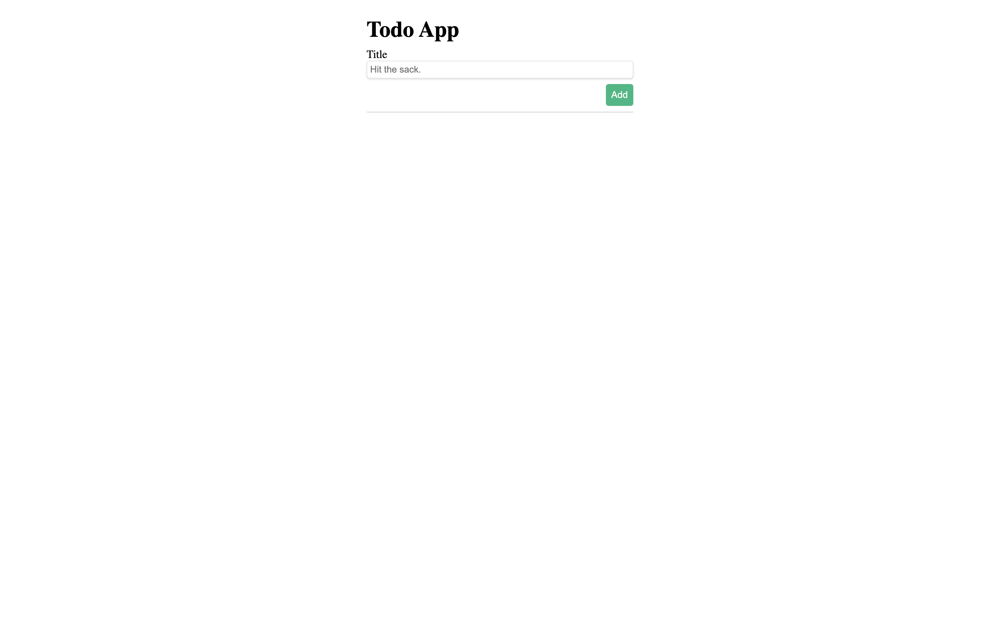
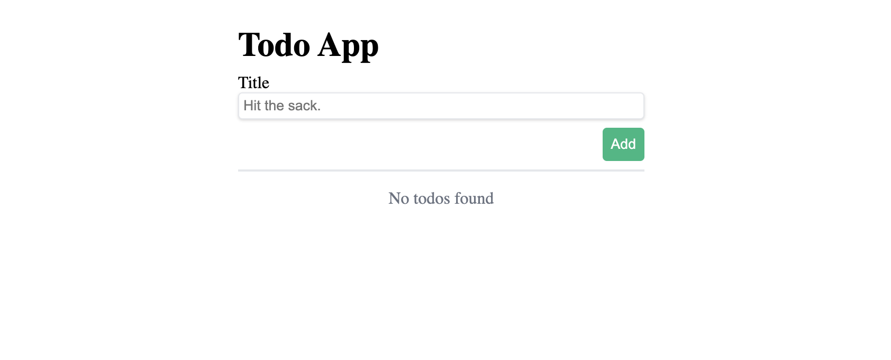
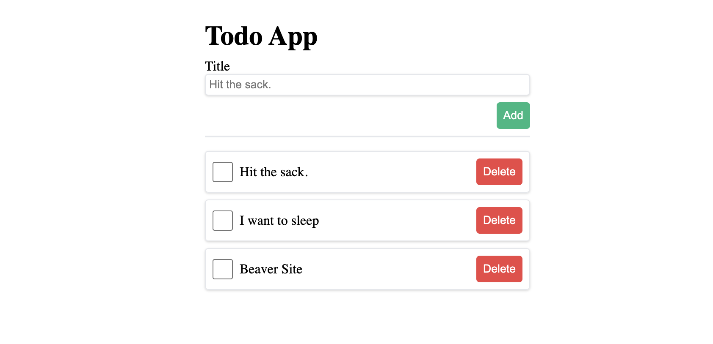

# Day 1 - Exercise 1

## Exercise 1.1
ให้น้องๆเขียน CSS ให้ไฟล์ **App.jsx** ให้ได้หน้าตาดังนี้



## Exercise 1.2
ให้น้อง ๆ สร้าง state ชื่อ **title** เพื่อให้เก็บค่าของ input title ของเรา และ เมื่อกดปุ่ม **Add** ให้ทำการ `console.log()` state **title** ออกมา

## Exercise 1.3
1. ให้น้องๆสร้าง state ชื่อ **todos** โดยให้ค่าเริ่มต้นเป็น Array เปล่า
2. ให้น้องๆสร้าง function มาจัดการ event ในปุ่ม **Add** โดยถ้าปุ่มถูกกดให้เพิ่ม object เข้าไปใน **todos** และ object มีหน้าตาแบบนี้

```javascript
{
   title: 'ค่าที่ได้มาจาก input title',
   completed: false
}
```

3. ให้น้องๆแก้ไขไฟล์ **App.jsx** ให้ เมื่อ **todos** มีสมาชิกเท่ากับ 0 ให้แสดงผลว่า `No todos found`
   
4. ให้น้องๆแก้ไขไฟล์ **App.jsx** ให้นำ **todos** มา Loop แสดงผลออกมาคล้ายๆตัวอย่างข้างล่าง
   

