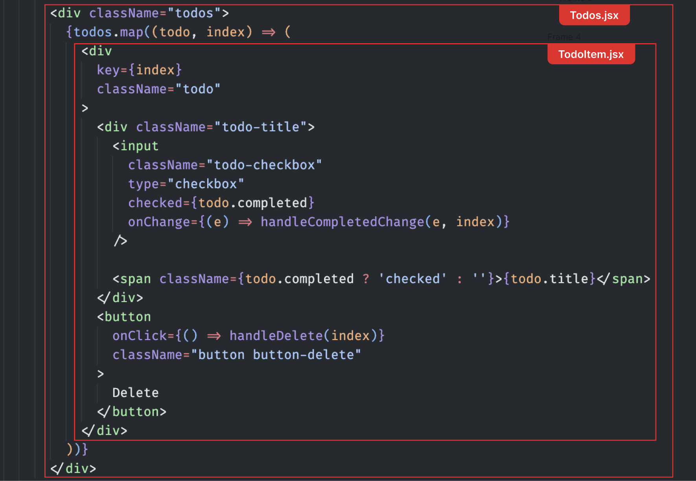

# Day 1 - Exercise 2

## Exercise 2.1
ให้น้อง ๆ แก้ไขไฟล์ **App.jsx** โดยให้แยก Components ออกเป็น 2 ส่วน ได้แก่

1. Todos
2. TodoItem

โดยที่เนื้อหาภายใน Components จะทำการแยกมาจากไฟล์ App.jsx ในการแยกนั้น น้อง ๆ สามารถดูตัวอย่างได้จากภาพด้านล่าง ว่าต้องตัดแบ่งส่วนไหนออกมา อย่างไร




> โดยที่ พี่ ๆ ได้ทำการเตรียม TodoItem.jsx และ Todos.jsx ไว้ให้แล้ว

```markdown
...
App.jsx
Todo.jsx
TodoItem.jsx
```

Todos.jsx


TodoItem.jsx


## Exercise 2.2

ให้น้องๆ ใช้ useEffect เพื่อแสดงค่าของ todos เมื่อค่า todos มีการเปลี่ยนแปลง โดยให้แสดงผลผ่าน Terminal ด้วย
`console.log(todos)`

## Exercise 2.3 (Extra 🫡)

> พี่ต้องยอมรับว่าน้องช่างมีความสามารถจริง ๆ ที่ทำจบได้ทันเวลา พี่จึงอยากให้น้อง ๆ ลองทำให้ Todo สามารถเพิ่ม แก้ไข และลบได้

ให้น้องๆ ใช้ useEffect เพื่อใช้ในการบันทึกค่า todos ลงไปใน localStorage เมื่อ todos มีการเปลี่ยนแปลง

### localStorage
`localStorage.setItem('myCat', 'Tom');` - ตั้งชื่อ Key ว่า myCat และ Value เป็น 'Tom'

`localStorage.setItem('myCat', JSON.stringify({...}));` - ตั้งชื่อ Key ว่า myCat และ Value เป็น Object

`localStorage.setItem('myCat', JSON.stringify([...]));` - ตั้งชื่อ Key ว่า myCat และ Value เป็น Array

`localStorage.getItem('myCat');` - ใช้เพื่อดึงค่ามาจาก localStorage โดยใช้ key ที่ชื่อว่า myCat

`localStorage.removeItem('myCat');` - ลบข้อมูลออกจาก localStorage โดยใช้ Key ที่ชื่อว่า myCat
