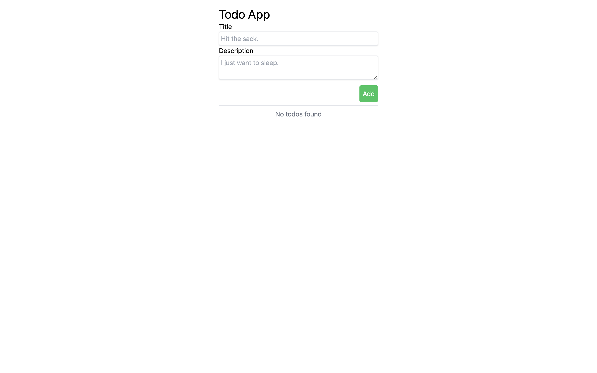
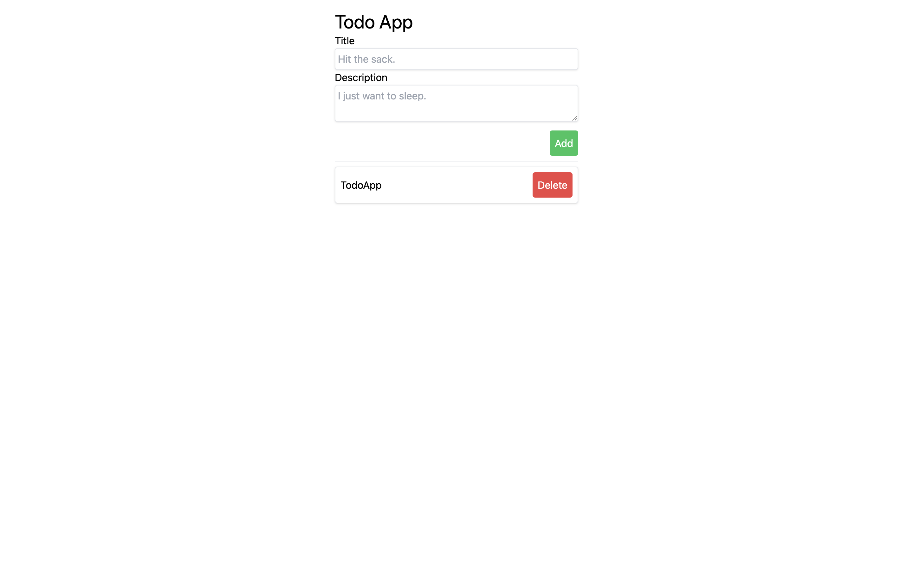

# Day 2 Exercise 1

## Exercise 1.1
ให้น้อง ๆ เพิ่ม Element ตัวใหม่ซึ่งเป็น textarea และ ตกแต่งให้สวยงาม

ตัวอย่าง



## Exercise 1.2
ให้น้องๆ ทำ router โดยมีดังนี้ `/`, `/:id` และให้แสดงผลตามนี้ 
```markdown
 `/` -> App.jsx

 `/:id` -> TodoInfo.jsx
```

## Exercise 1.3
ให้น้อง ๆ แก้ไขไฟล์ **App.jsx** โดยให้นำ Checkbox ออกแล้ว ทำให้สามารถกดที่รายการ todo นั้นๆ เพื่อเปลี่ยนไปอีกหน้าหนึ่งแทนโดยให้ param เป็น ลำดับในสมาชิกของ **todos**

เช่น กดที่ todo ลำดับที่ 0 ก็จะทำการเปลี่ยนหน้าไปยัง `localhost:5137/0`


