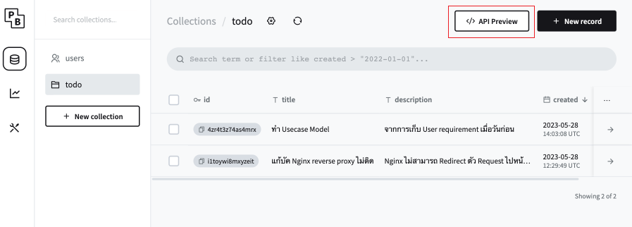
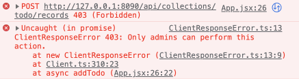
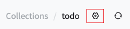
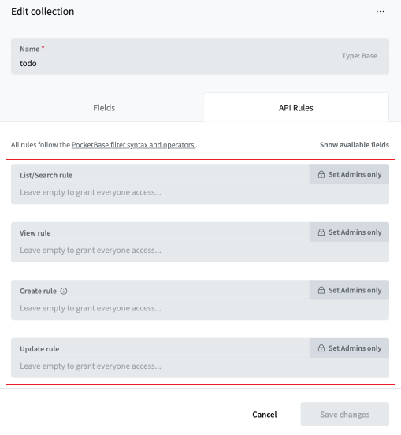

# Day 2 Exercise 2

## Exercise 2.1
ให้น้องๆ สร้าง Collection ใน PocketBase ชื่อ `todo` โดยมี Fields ดังนี้

1. title เป็น Plain text
2. description เป็น Plain text

## 🚨 คำแนะนำในการใช้งาน PocketBase

- น้อง ๆ สามารถอ่าน API Preview ที่ด้านขวาบนได้

- หากน้อง ๆ ทำการ Query ข้อมูลใด ๆ หรือ ส่ง Request แล้วพบว่าเกิด Error ดังรูปภาพด้านล่าง

ให้น้อง ๆ ทำการเปลี่ยน API Rules โดยการที่
1. กดเข้าไปที่รูปเฟืองด้านบน 

2. เลือก **API Rules**
3. ทำการปลดล็อก Rules ทั้งหมดออก จะได้ดังรูป  

## Exercise 2.2

### (Create)

ให้น้องๆ แก้ไขไฟล์ **App.jsx** เป็นเมื่อกดปุ่ม Add ให้เพิ่มข้อมูล เข้าไปใน Collection `todo` ใน PocketBase

## Exercise 2.3

### (Read)

ให้น้อง ๆ แก้ไขไฟล์ **App.jsx** โดยใช้ useEffect ไปดึงข้อมูลทั้งหมดจาก Collection `todo` ใน PocketBase มาใส่ใน state `todo`

## Exercise 2.4

### (React routing + Read)

ให้น้อง ๆ แก้ไขไฟล์ **TodoInfo.jsx** โดยให้นำ URL parameter ที่รับมาเป็น id ไปใช้ในการดึงข้อมูลจาก Collection `todo` ใน PocketBase มาใส่ใน state `todo` โดยใช้ useEffect

## Exercise 2.5 (Extra 🫡)

### (Update)

ให้น้อง ๆ แก้ไขไฟล์ **TodoInfo.jsx** เป็นเมื่อกดปุ่ม **Edit** แล้วกด **Save** ให้นำข้อมูลไป Update ใน Collection `todo` ใน PockeBase ตาม param id

## Exercise 2.6 (Extra 🫡)

### (Delete)

ให้น้องๆ แก้ไขไฟล์ **App.jsx** เป็นเมื่อกดปุ่ม Delete ให้ลบข้อมูล ออก Collection `todo` ใน PocketBase ตาม param id