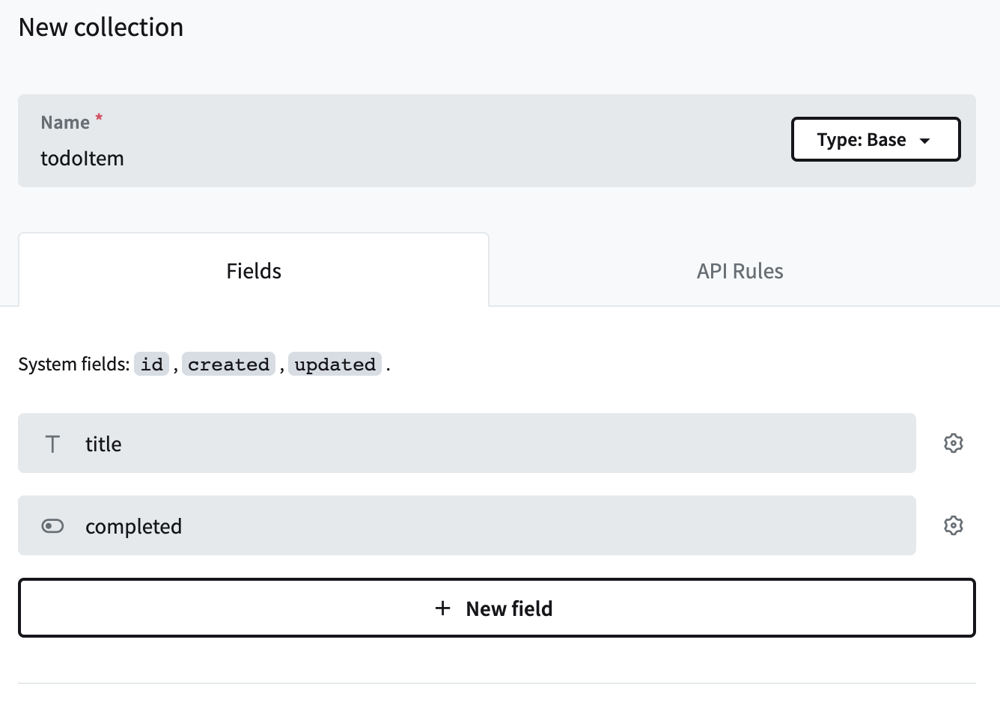
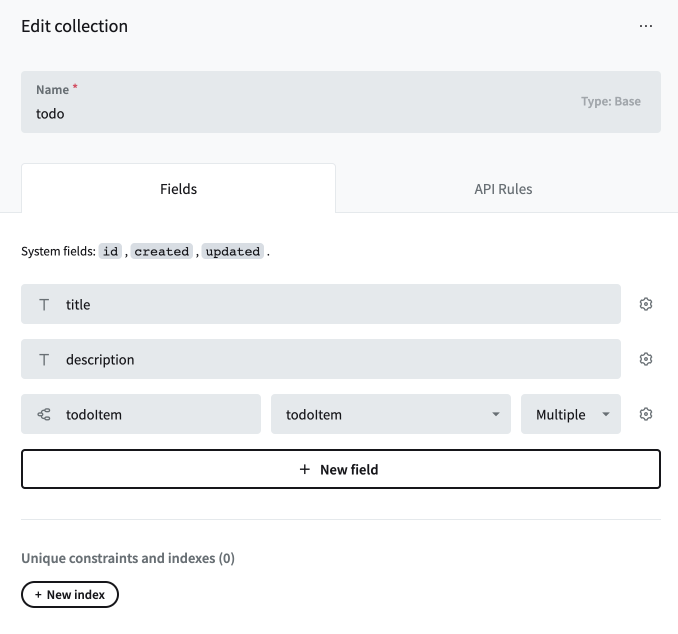
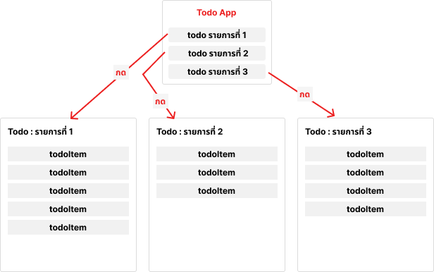

# Day 2 Exercise 3

## Exercise 3.1
ให้น้อง ๆ สร้าง Collection ใน PocketBase ชื่อ `todoItem` โดยมี field ดังนี้

1. title เป็น Plain text
2. completed เป็น Boolean
   
น้อง ๆ จะได้ผลลัพธ์ของ Collection todoItem ตามรูปตัวอย่าง ด้านล่าง

## Exercise 3.2
ให้น้อง ๆ แก้ไข Collection ใน PocketBase ที่ชื่อ `todo` ดังนี้

1. สร้าง Field ใหม่เป็นประเภท Relation ตั้งชื่อของ Field ว่า todoItem
2. todoItem จะมี Relationship กับ todoItem และ เป็นแบบ multiple

น้อง ๆ จะได้ผลลัพธ์ของ Collection todo ตามรูปตัวอย่าง ด้านล่าง

หลักการทำงานของโปรแกรม คือ จะมีรายการ todo หลาย ๆ รายการอยู่ ซึ่งในแต่ละรายการก็จะมี todoItem อยู่หลาย ๆ รายการอยู่ภายใน

ดังนั้น เมื่อน้อง ๆ กดเข้าไปดูข้อมูลของรายการ todo แต่ละรายการก็จะมี todoItem อยู่ภายใน ซึ่งแน่นอนว่าสามารถมากกว่าหนึ่งรายการก็ได้! และ ส่วนนี้ก็จะเป็นโจทย์ที่น้อง ๆ ต้องทำนั่นเอง

ตัวอย่างห้าตา Flow การทำงาน

## Exercise 3.3
ให้น้อง ๆ แก้ไขไฟล์ **TodoInfo.jsx** โดยการทำให้เมื่อกดปุ่ม Add ให้เพิ่มข้อมูล todoItem เข้าไปใน Collection todoItem ใน PocketBase
และ รายการ todoItem ที่เพิ่มไปนั้น ก็จะอยู่ภายใต้ todo นั้น ๆ ด้วย

## Exercise 3.4
ให้น้อง ๆ แก้ไขไฟล์ **TodoInfo.jsx** โดยเมื่อทำการกดปุ่ม Delete ให้ลบข้อมูล ออกจาก Collection todoItem ใน PocketBase
